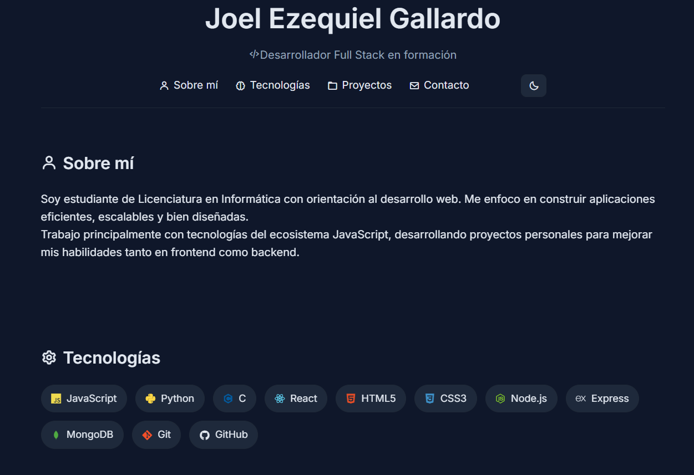

# 🚀 Mi Portafolio Increíble

[](https://reactjs.org/)
[](https://vitejs.dev/)
[](LICENSE)

¡Bienvenido a mi portafolio personal! Esta es una aplicación web moderna y elegante construida con React y Vite, que muestra mis proyectos, habilidades y experiencia. Está diseñada para ser rápida, responsiva y visualmente impresionante.

## ✨ Características

- **Diseño Responsivo**: Se ve genial en todos los dispositivos - escritorio, tablet y móvil
- **Modo Oscuro/Claro**: Cambia entre temas con un solo clic
- **Animaciones Suaves**: Transiciones atractivas y efectos hover
- **Muestra de Proyectos**: Destaca tu mejor trabajo con tarjetas interactivas
- **Sección de Habilidades**: Muestra tu experiencia técnica
- **Formulario de Contacto**: Forma fácil para que los visitantes se comuniquen
- **Carga Rápida**: Optimizada con Vite para un rendimiento ultrarrápido

## 🛠️ Tecnologías Utilizadas

- **Frontend**: React 19, JavaScript
- **Herramienta de Construcción**: Vite
- **Estilos**: CSS3 con propiedades personalizadas
- **Linting**: ESLint
- **Despliegue**: Listo para Vercel, Netlify, o cualquier hosting estático

## 🚀 Instalación

1. **Clona el repositorio**
   ```bash
   git clone https://github.com/tuusuario/portafolio.git
   cd portafolio
   ```

2. **Instala las dependencias**
   ```bash
   npm install
   ```

3. **Inicia el servidor de desarrollo**
   ```bash
   npm run dev
   ```

4. **Abre tu navegador** y visita `http://localhost:5173`

## 📖 Uso

- Navega por las diferentes secciones usando la barra de navegación
- Alterna entre modos oscuro y claro
- Explora proyectos haciendo clic en las tarjetas de proyecto
- Usa el formulario de contacto para enviar mensajes

## 📸 Capturas de Pantalla



*Agrega tus propias capturas aquí para mostrar tu portafolio*

## 🤝 Contribuyendo

¡Las contribuciones son bienvenidas! Si tienes sugerencias o mejoras:

1. Haz un fork del repositorio
2. Crea una rama de funcionalidad (`git checkout -b feature/funcionalidad-increible`)
3. Confirma tus cambios (`git commit -m 'Agrega funcionalidad increíble'`)
4. Sube a la rama (`git push origin feature/funcionalidad-increible`)
5. Abre un Pull Request


## 📞 Contacto

- **Email**: ezequieljoelgallardo@gmail.com
- **LinkedIn**: https://www.linkedin.com/in/joel-ezequiel-gallardo-b4591a345/
- **Sitio Web**: [Demo en Vivo](https://tuportafolio.com)

---

Hecho con ❤️ y mucho ☕ por J. Ezequiel Gallardo

